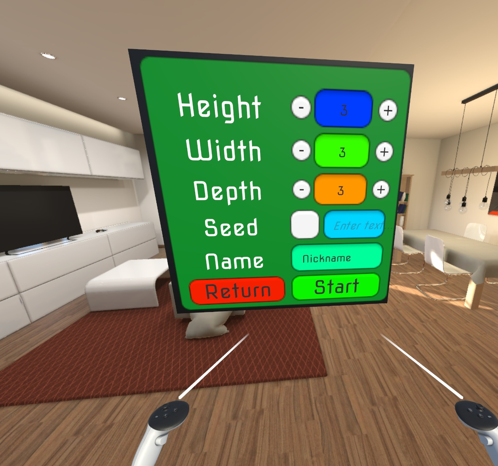
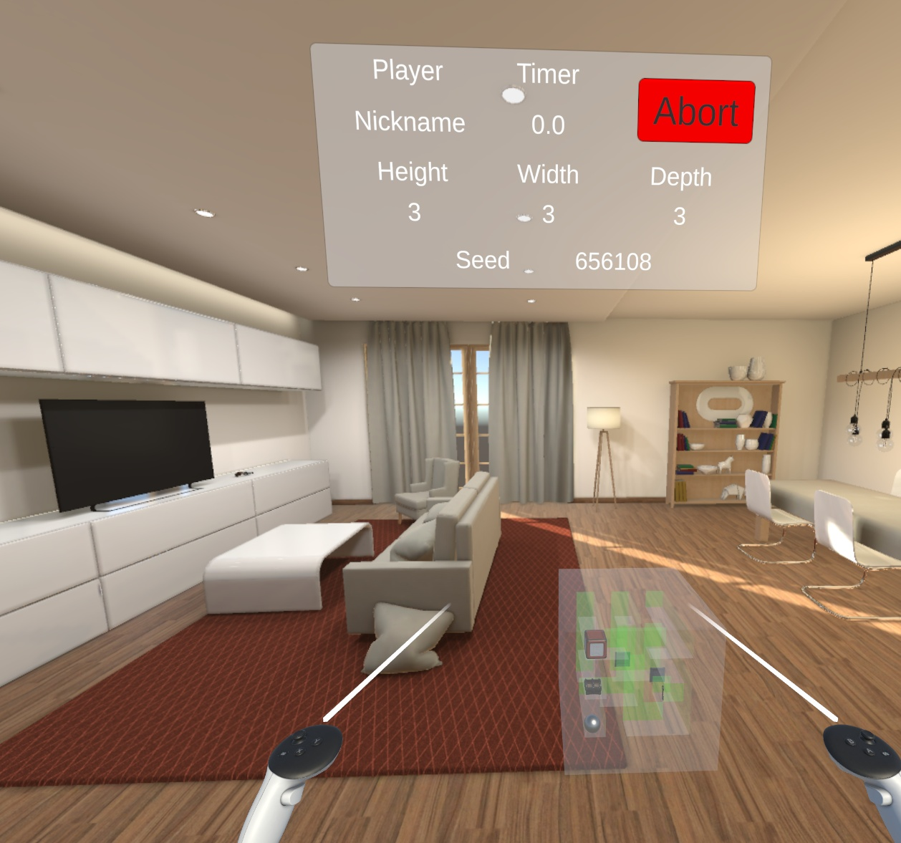
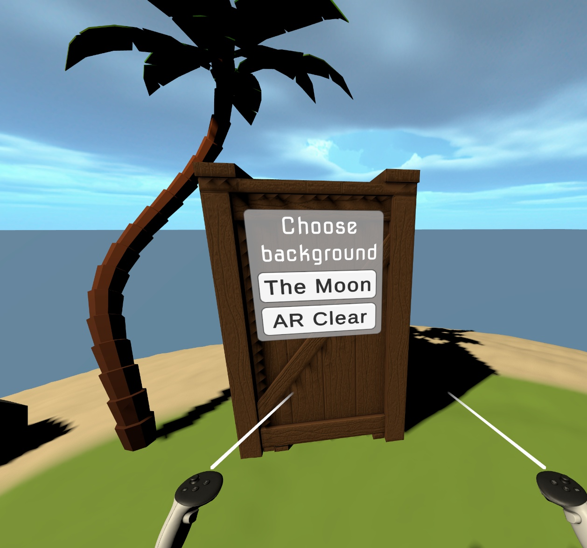
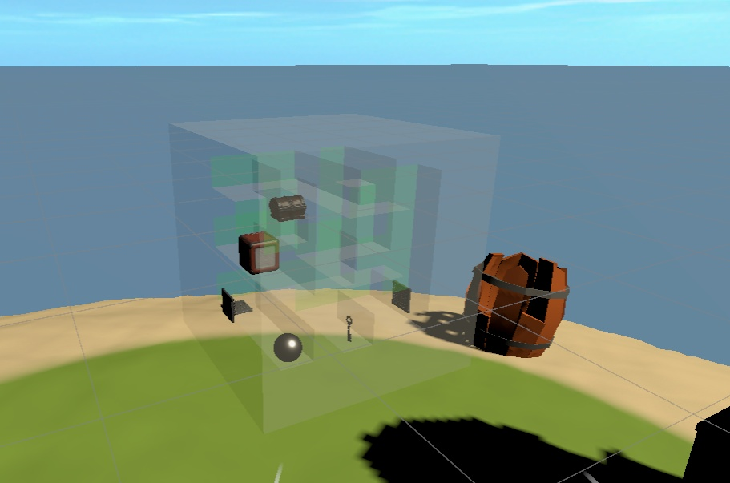
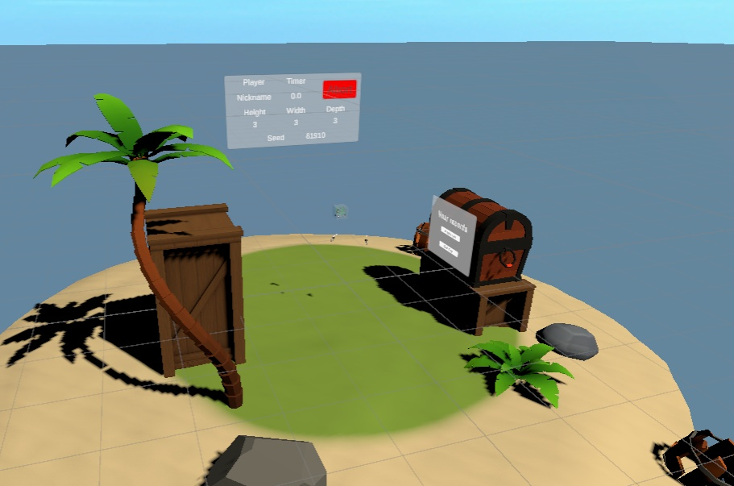
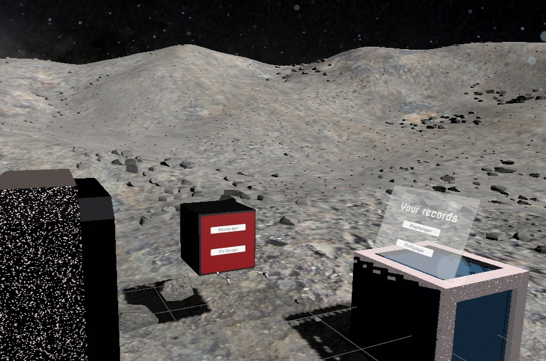
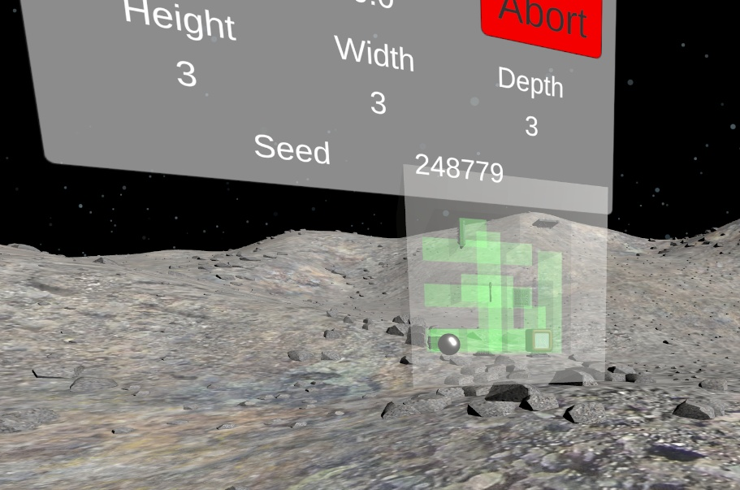
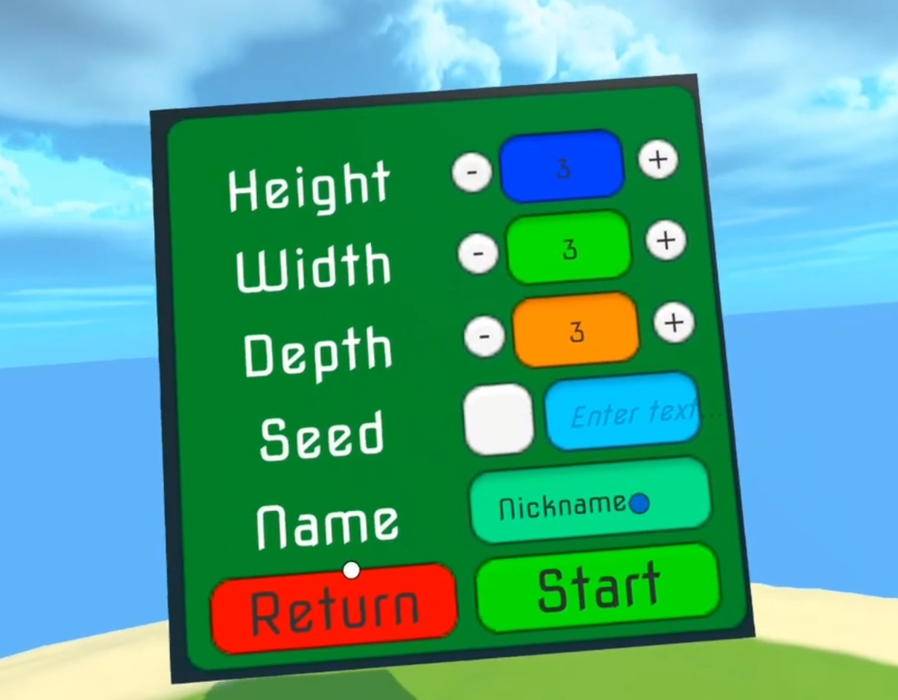
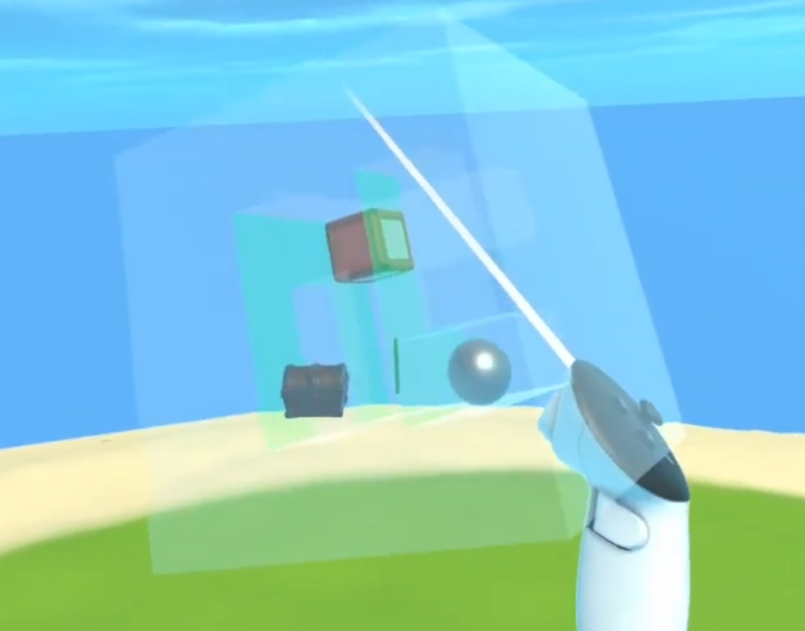

# 🎲 CubeMaze  
VR puzzle game for Oculus Quest where players guide a ball through procedurally generated 3D mazes inside a rotating cube. Built in Unity with Meta XR SDK, featuring traps, keys, multiplayer challenges, and an optional passthrough mode.  

# Made By
Filip Tryhuk, Wojciech Zamarski, and Sebastian Zych.

As part of our Master of Science in Computer Science studies at Cracow University of Technology, specializing in Intelligent Systems & Augmented Reality, we worked together on several academic projects.
These projects were developed during courses such as Game Programming, Virtual and Augmented Reality Design, and Augmented Reality in Engineering Applications.

## Overview  
**CubeMaze** is a **VR puzzle game** developed for **Oculus Quest (1, 2, and 3)**.  
The player must guide a ball through a maze hidden inside a rotating cube, avoiding traps and collecting keys to unlock passages.  

The game combines **procedural generation** with immersive VR mechanics, while also offering a **Passthrough (AR-like) mode**, where players can see their real surroundings while playing. This makes CubeMaze both an engaging VR experience and a lightweight introduction to mixed reality.  

## Key Features  
- **Procedural maze generation** using depth-first search (DFS) algorithm, ensuring unique solvable puzzles.  
- **VR interaction mechanics** – tilt and rotate the cube using Oculus Quest controllers.  
- **Interactive obstacles**:  
  - Locked doors and collectible keys.  
  - Retractable spike traps.  
- **Multiplayer mode** – competitive runs with a shared ranking system.  
- **Progression system** – save and review best times and replay past puzzles.  
- **Immersive environments** – themed VR scenes such as a tropical island or lunar station.  
- **Passthrough mode** – play with your real surroundings visible, blending VR gameplay with AR-like visibility.  
- **Audiovisual feedback** – background music, sound effects for collisions, traps, and keys, and controller haptics tied to gameplay events.  

## Technologies Used  
- **Unity Engine (C#)** – core development and scripting.  
- **Meta XR All-in-One SDK** (Core, Interaction, Haptics, Audio, Voice, Platform).  
- **Meta Building Blocks** for Passthrough, controller tracking, hand tracking, ray interaction, and VR hands/keyboard.  
- **Meta XR Simulator** for testing without a headset.  

## Skills Demonstrated  
- **Procedural generation** of 3D mazes with algorithmic placement of interactive elements.  
- Development for **VR platforms (Oculus Quest)** including passthrough integration and haptic feedback.  
- Design of **multiplayer ranking systems** and local leaderboards.  
- Building immersive **UI systems** directly inside the 3D game world.  
- **Scene design & optimization** for VR/AR environments.  
- End-to-end **XR development workflow**, from prototyping to real-device testing.  

## Screenshots  
## Screenshots
<table>
  <tr>
    <td></td>
    <td></td>
  </tr>
  <tr>
    <td></td>
    <td></td>
  </tr>
  <tr>
    <td></td>
    <td></td>
  </tr>
  <tr>
    <td></td>
    <td></td>
  </tr>
  <tr>
    <td></td>
    <td></td>
  </tr>
</table>

